# Informe de Análisis Exploratorio de Datos (EDA)
## Dataset: Disturbed YouTube for Kids - Clasificación de Videos Inapropiados para Niños

**Autor:** ੯‧̀͡⬮  
**Fecha:** 13 de septiembre de 2026  
**Proyecto:** Machine Learning Project - Clasificación de contenido inapropiado para niños

---

## 1. Introducción

Este informe presenta el análisis exploratorio de datos (EDA) realizado sobre el dataset "Disturbed YouTube for Kids", el cual contiene videos de YouTube clasificados según su apropiación para niños pequeños. El objetivo principal de este análisis es comprender la estructura, distribución y características de los datos para el posterior entrenamiento de un modelo de machine learning capaz de detectar automáticamente contenido inapropiado.

El fenómeno de "Elsagate" se refiere a videos en YouTube que, a primera vista, parecen apropiados para niños (personajes conocidos, colores brillantes, música infantil) pero contienen contenido perturbador o inapropiado. Este dataset busca caracterizar y detectar este tipo de contenido.

---

## 2. Descripción del Dataset

### 2.1 Estructura General

El dataset se compone de dos tipos de archivos:

**Dataset de Entrenamiento (Ground Truth):**
- **Archivo:** `dataset_groundtruth.csv`
- **Total de videos:** 4,797 videos
- **Etiquetado:** 100% manual por humanos
- **Propósito:** Entrenamiento del modelo de clasificación

**Datasets Adicionales (Para Pruebas):**
- **elsagate_related_videos:** ~233K videos (5 partes comprimidas)
- **other_child_related_videos:** ~155K videos (3 partes comprimidas)
- **random_videos:** ~482K videos (8 partes comprimidas)
- **popular_videos:** ~11K videos (archivo único comprimido)
- **Propósito:** Pruebas y predicciones con el modelo entrenado

### 2.2 Variables Principales

El dataset contiene las siguientes variables principales:

**Variables de Identificación:**
- `video_id`: Identificador único del video en YouTube
- `title`: Título del video
- `channel_id`: Identificador del canal
- `channel_title`: Nombre del canal

**Variables de Contenido:**
- `description`: Descripción del video
- `tags`: Etiquetas asociadas al video
- `category_id`: Categoría de YouTube
- `duration_seconds`: Duración en segundos
- `definition`: Calidad de video (hd, sd, etc.)

**Variables de Engagement:**
- `view_count`: Número de visualizaciones
- `like_count`: Número de likes
- `dislike_count`: Número de dislikes
- `comment_count`: Número de comentarios

**Variables de Clasificación:**
- `classification_label`: Etiqueta manual (ground truth)
- `prediction`: Predicción automática del clasificador
- `is_ground_truth`: Indicador de etiqueta manual

---

## 3. Metodología

### 3.1 Enfoque del Análisis

El EDA se dividió en dos partes principales:

1. **Análisis Completo del Dataset de Entrenamiento:** Se realizó un análisis exhaustivo del dataset `dataset_groundtruth.csv` que contiene las etiquetas manuales confiables necesarias para el entrenamiento del modelo.

2. **Análisis Breve de Datasets Adicionales:** Se analizaron muestras de 1,000 videos de cada dataset adicional para comprender su estructura y distribución de predicciones automáticas.

### 3.2 Herramientas Utilizadas

- **Python 3.x** como lenguaje de programación principal
- **Pandas** para manipulación y análisis de datos
- **Matplotlib y Seaborn** para visualización de datos
- **Jupyter Notebook** como entorno de análisis interactivo

---

## 4. Análisis del Dataset de Entrenamiento (Ground Truth)

### 4.1 Distribución de Clases

El dataset de entrenamiento contiene 4,797 videos distribuidos en 4 categorías:

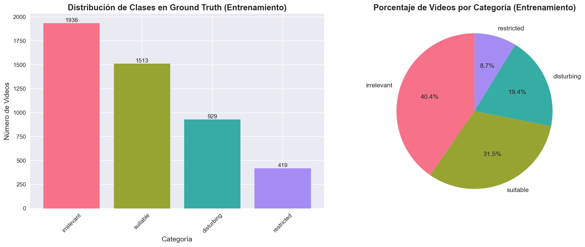

**Tabla 1: Distribución de Clases en Ground Truth**

| Categoría | Cantidad | Porcentaje |
|-----------|----------|------------|
| Irrelevant | 1,936 | 40.4% |
| Suitable | 1,513 | 31.5% |
| Disturbing | 929 | 19.4% |
| Restricted | 419 | 8.7% |
| **Total** | **4,797** | **100%** |

**Observaciones:**
- La clase mayoritaria es "irrelevant" (40.4%), seguida de "suitable" (31.5%)
- Las clases de interés para detección ("disturbing" y "restricted") representan el 28.1% del dataset
- Existe un desbalance de clases que deberá considerarse en el entrenamiento del modelo

### 4.2 Estadísticas Descriptivas

**Tabla 2: Estadísticas Descriptivas de Variables Numéricas**

| Variable | Datos válidos | Media | Desv. estándar | Mínimo | P25 | Mediana | P75 | Máximo |
|----------|---------------:|------:|---------------:|-------:|----:|--------:|----:|-------:|
| view_count | 4,794 | 6,142,717.00 | 43,836,540.00 | 0 | 1,140 | 90,093.50 | 1,775,453 | 1,664,660,000 |
| like_count | 4,669 | 26,878.13 | 155,478.80 | 0 | 10 | 502.00 | 10,122 | 4,392,637 |
| dislike_count | 4,669 | 3,718.92 | 25,425.08 | 0 | 1 | 53.00 | 1,097 | 1,071,513 |
| comment_count | 4,569 | 2,378.41 | 12,849.85 | 0 | 1 | 49.00 | 763 | 323,267 |
| duration_seconds | 4,796 | 752.06 | 1,986.99 | 0 | 167 | 345.50 | 706.25 | 39,433 |

**Observaciones:**
- Las métricas de engagement presentan alta variabilidad y valores ausentes, especialmente `comment_count` (228 faltantes) y `like_count`/`dislike_count` (128 faltantes cada uno)
- La duración promedio es de 752.06 segundos (12.5 minutos), mientras que la mediana es de 345.5 segundos (5.8 minutos)
- Los máximos muestran outliers significativos, sobre todo en visualizaciones y duración

### 4.3 Análisis de Engagement por Categoría

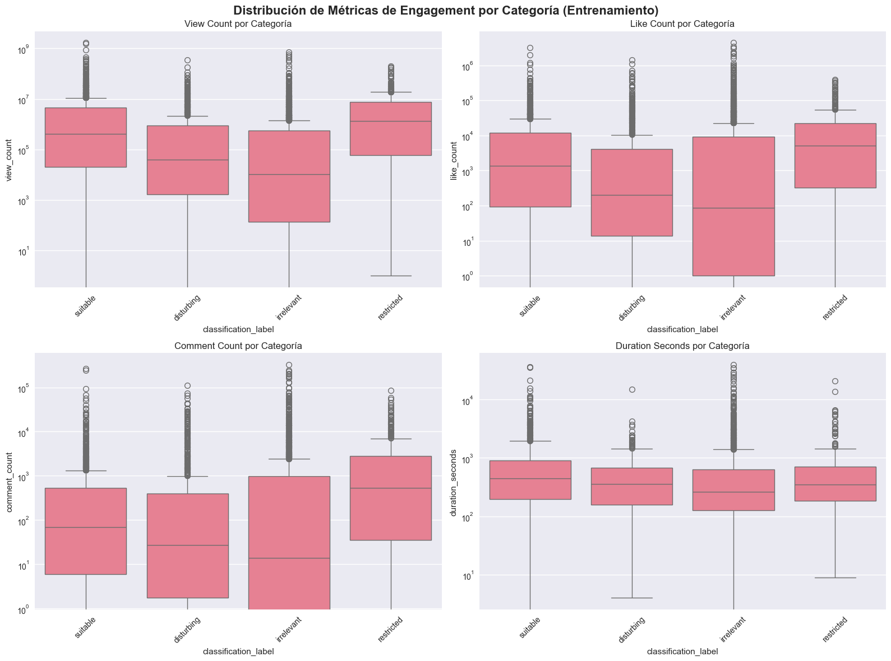

**Tabla 3: `view_count` por categoría**

| Categoría | Datos válidos | Media | Mediana | Desv. estándar | Mínimo | Máximo |
|-----------|---------------:|------:|--------:|---------------:|-------:|-------:|
| Disturbing | 929 | 3,193,286.59 | 39,144 | 15,452,148.11 | 0 | 341,629,900 |
| Irrelevant | 1,934 | 3,486,723.52 | 10,436 | 29,164,201.75 | 0 | 699,895,100 |
| Restricted | 419 | 8,272,591.13 | 1,348,394 | 21,829,769.40 | 1 | 194,569,100 |
| Suitable | 1,512 | 10,761,959.60 | 407,330 | 68,498,396.60 | 0 | 1,664,660,000 |

**Tabla 3.1: `like_count` por categoría**

| Categoría | Datos válidos | Media | Mediana | Desv. estándar | Mínimo | Máximo |
|-----------|---------------:|------:|--------:|---------------:|-------:|-------:|
| Disturbing | 921 | 18,536.99 | 202 | 82,705.15 | 0 | 1,403,940 |
| Irrelevant | 1,908 | 35,003.91 | 87 | 210,949.86 | 0 | 4,392,637 |
| Restricted | 415 | 25,398.39 | 5,130 | 55,684.65 | 0 | 394,991 |
| Suitable | 1,425 | 21,820.08 | 1,342 | 119,035.69 | 0 | 3,228,147 |

**Tabla 3.2: `comment_count` por categoría**

| Categoría | Datos válidos | Media | Mediana | Desv. estándar | Mínimo | Máximo |
|-----------|---------------:|------:|--------:|---------------:|-------:|-------:|
| Disturbing | 904 | 1,705.64 | 27.0 | 7,041.60 | 0 | 111,492 |
| Irrelevant | 1,867 | 3,170.56 | 14.0 | 16,640.42 | 0 | 323,267 |
| Restricted | 410 | 3,379.91 | 531.0 | 8,173.27 | 0 | 86,011 |
| Suitable | 1,388 | 1,455.22 | 69.5 | 10,816.97 | 0 | 269,473 |

**Observaciones:**
- Los videos "suitable" tienen la mayor media de visualizaciones (10,761,959.60), mientras que "restricted" tiene la mayor mediana de visualizaciones
- La media de likes es mayor en "irrelevant" y la media de comentarios en "restricted"
- Las medias están fuertemente afectadas por outliers; por ello, las medianas ofrecen una comparación más robusta entre categorías

### 4.4 Categorías de YouTube

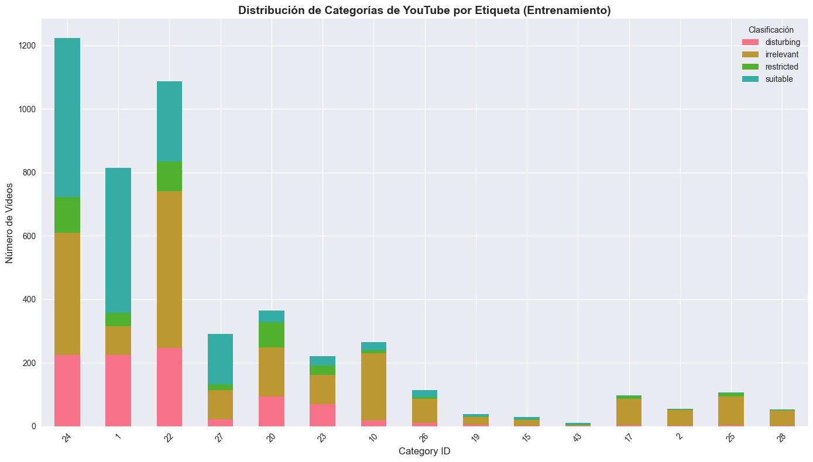

**Análisis:**
- Las categorías más frecuentes corresponden a contenido infantil y entretenimiento
- Se observa una diversidad de categorías, lo que indica que el dataset abarca diferentes tipos de contenido
- Algunas categorías predominan en ciertas clases de clasificación

### 4.5 Análisis de Duración de Videos

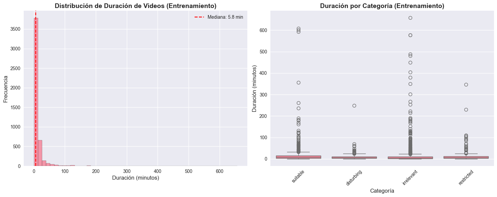

**Tabla 4: Estadísticas de Duración por Categoría (segundos)**

| Categoría | Datos válidos | Media | Mediana | Desviación estándar | Mínimo | Máximo |
|-----------|---------------:|------:|--------:|-------------------:|-------:|-------:|
| Disturbing | 929 | 508.71 | 359.0 | 656.71 | 4 | 14,959 |
| Irrelevant | 1,936 | 785.71 | 264.0 | 2,401.49 | 0 | 39,433 |
| Restricted | 419 | 703.29 | 350.0 | 1,471.53 | 9 | 20,826 |
| Suitable | 1,512 | 872.00 | 443.5 | 2,055.90 | 0 | 36,524 |

**Observaciones:**
- Los videos "suitable" tienen la mayor duración media (872.00 segundos) y mediana (443.5 segundos)
- Las medianas se sitúan entre 264 y 443.5 segundos (4.4-7.4 minutos)
- La variabilidad es especialmente alta en "irrelevant" y "suitable" por la presencia de videos muy largos

### 4.6 Calidad de Video

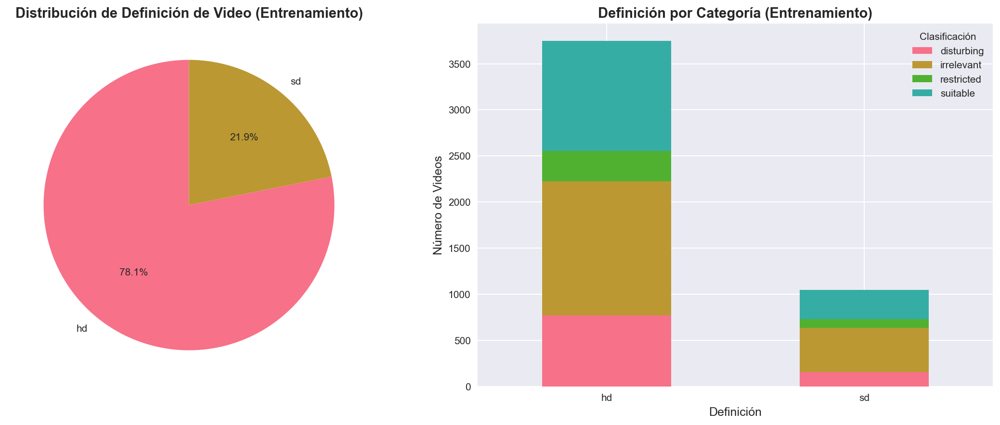

**Tabla 5: Distribución de Calidad de Video**

| Definición | Cantidad | Porcentaje (sobre 4,797) |
|------------|---------:|-------------------------:|
| hd | 3,748 | 78.1% |
| sd | 1,048 | 21.8% |

**Observaciones:**
- La mayoría de los videos (78.1%) están en alta definición (HD)
- La calidad del video no parece estar directamente correlacionada con la clasificación de contenido
- Hay un registro sin definición (`value_counts` suma 4,796); los porcentajes del notebook se calculan sobre el total de 4,797 videos

**Tabla 5.1: Definición por categoría**

| Definición | Disturbing | Irrelevant | Restricted | Suitable |
|------------|----------:|-----------:|-----------:|---------:|
| hd | 771 | 1,456 | 326 | 1,195 |
| sd | 158 | 480 | 93 | 317 |

### 4.7 Análisis de Tags

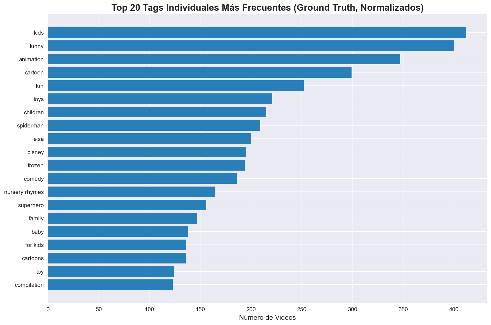

Se identificaron **3,705 tags únicos** y **3,914 tags en total** contando repeticiones.

**Tabla 6: Top 20 tags más frecuentes**

| Posición | Tag | Frecuencia |
|---------:|-----|-----------:|
| 1 | Foster's\|Home\|for\|Imaginary\|Friends\|Foster's H... | 13 |
| 2 | thomas jerry\|tom a jerry\|tom and jarry\|tom and... | 12 |
| 3 | tom and jerry\|episodes\|english\|tom and jerry f... | 11 |
| 4 | YouTube Capture | 9 |
| 5 | pj masks\|pj masks disney\|disney junior\|pj mask... | 8 |
| 6 | Cartoon\|full episode\|YTV\|kids tv\|retro cartoon... | 7 |
| 7 | Disney Disney Videos Disney YouTube The Walt D... | 7 |
| 8 | YouTube Editor | 6 |
| 9 | iMovie | 6 |
| 10 | tom and jerry\|episodes\|english\|cartoons for ki... | 6 |
| 11 | peppa pig\|peppa pig english episodes\|peppa pig... | 6 |
| 12 | Jayce And The Wheeled Warriors (TV Program)\|Ac... | 6 |
| 13 | “Zig et Sharko”\|“Zig und Sharko”\|“Zig y sharko... | 6 |
| 14 | Galaxy\|Galaxy High School\|Ep#1\|English\|TMS | 6 |
| 15 | DRAGON BALL Z\|marvels\|dc\|comics\|funny\|marvel\|D... | 5 |
| 16 | CartoonKids TBKCM\|cartton for kids\|cartoon vid... | 5 |
| 17 | Tom&jerry\|full episodes\|Tom and jerry\|Tom& jer... | 5 |
| 18 | #hangoutsonair\|Hangouts On Air\|#hoa | 5 |
| 19 | mobile | 4 |
| 20 | goanimate\|cartoon | 4 |

**Observaciones:**
- Los tags más frecuentes corresponden a contenido infantil y educativo
- La presencia de tags específicos puede ser un feature importante para la clasificación
- Algunos tags podrían ser indicadores de contenido potencialmente inapropiado

### 4.8 Análisis de Títulos

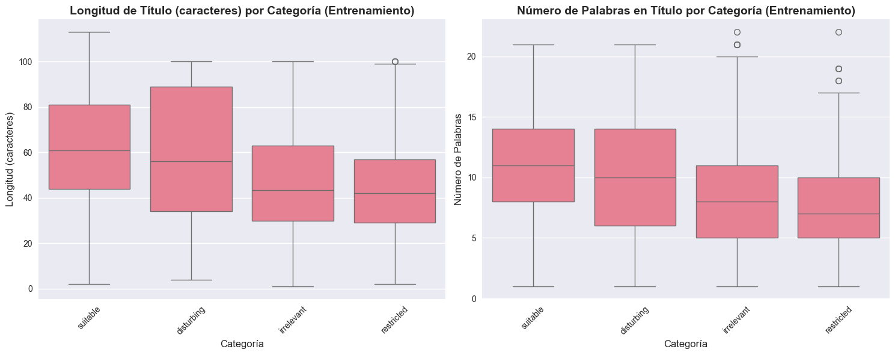

**Estadísticas generales de títulos**

| Medida | Longitud del título | Palabras del título |
|--------|--------------------:|--------------------:|
| Datos válidos | 4,797 | 4,797 |
| Media | 53.74 | 9.34 |
| Desviación estándar | 24.92 | 4.37 |
| Mínimo | 1 | 1 |
| Primer cuartil | 34 | 6 |
| Mediana | 51 | 9 |
| Tercer cuartil | 73 | 13 |
| Máximo | 113 | 22 |

**Tabla 7: Estadísticas de títulos por categoría**

| Categoría | Longitud media | Longitud mediana | Desv. estándar | Palabras media | Palabras mediana | Desv. estándar |
|-----------|---------------:|-----------------:|---------------:|---------------:|-----------------:|---------------:|
| Disturbing | 58.98 | 56.0 | 28.18 | 10.04 | 10.0 | 4.55 |
| Irrelevant | 46.80 | 43.5 | 22.82 | 8.12 | 8.0 | 4.17 |
| Restricted | 44.79 | 42.0 | 20.88 | 7.79 | 7.0 | 3.70 |
| Suitable | 61.88 | 61.0 | 22.98 | 10.91 | 11.0 | 4.05 |

**Observaciones:**
- Los títulos de videos "suitable" tienen la mayor longitud media (61.88 caracteres) y cantidad media de palabras (10.91); "disturbing" ocupa el segundo lugar
- La longitud del título podría ser un feature discriminante
- "restricted" presenta los títulos más cortos en promedio, mientras que "irrelevant" tiene más observaciones

### 4.9 Detección de Outliers

Se aplicó el método del rango intercuartílico (IQR) sobre las cinco variables numéricas (`view_count`, `like_count`, `dislike_count`, `comment_count`, `duration_seconds`), tanto en su escala original como sobre una transformación logarítmica (`log1p`). Esta segunda versión es necesaria porque, dada la fuerte asimetría de las métricas de engagement (ver Tabla 2), el IQR calculado en escala original marca como "outlier" a una fracción muy grande de las observaciones, lo cual no es informativo.

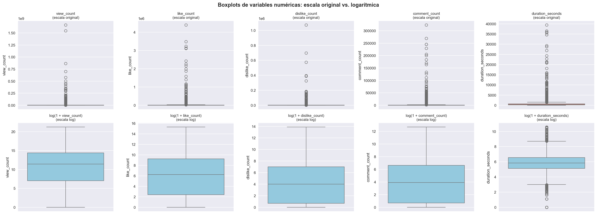

**Tabla 12: Outliers detectados por variable (método IQR)**

| Variable | N° Outliers (escala original) | % Outliers (original) | N° Outliers (escala log) | % Outliers (log) |
|----------|-------------------------------:|-----------------------:|---------------------------:|-------------------:|
| view_count | 802 | 16.73% | 0 | 0.00% |
| like_count | 730 | 15.64% | 0 | 0.00% |
| dislike_count | 791 | 16.94% | 0 | 0.00% |
| comment_count | 721 | 15.78% | 0 | 0.00% |
| duration_seconds | 385 | 8.03% | 173 | 3.61% |

**Observaciones:**
- En escala original, el IQR detecta una alta cantidad de "outliers" en las variables de engagement (entre 15.6% y 16.9%, superando los 700 videos en cada una) debido a la asimetría extrema y cola pesada típica de YouTube (ver máximos en Tabla 2).
- En escala logarítmica (`log1p`), el número de outliers en las cuatro variables de engagement desciende a **0 (0.00%)**, demostrando que las observaciones siguen una distribución log-normal coherente y no constituyen errores ni datos anómalos. Únicamente `duration_seconds` retiene 173 outliers (3.61%) correspondientes a videos notablemente cortos o largos.
- Al cruzar los valores extremos de `view_count` (> 4.4M) y `like_count` (> 25.3K) con `classification_label`, se observa que están repartidos entre todas las clases (en vistas: 379 suitable, 175 irrelevant, 132 restricted y 116 disturbing; en likes: 300 irrelevant, 214 suitable, 121 disturbing y 95 restricted). Por ende, corresponden a contenido popular legítimo dentro de cada categoría y no deben descartarse, sino normalizarse o transformarse mediante log1p en la Etapa 2.

### 4.10 Cuantificación del Desbalance de Clases

Complementando la distribución de clases de la Sección 4.1, se calculó el ratio de desbalance (*imbalance ratio*, IR) de cada clase respecto a la clase mayoritaria (`irrelevant`).

**Tabla 13: Ratio de desbalance por clase**

| Categoría | Cantidad | IR respecto a "irrelevant" |
|-----------|---------:|----------------------------:|
| Irrelevant | 1,936 | 1.00x |
| Suitable | 1,513 | 1.28x |
| Disturbing | 929 | 2.08x |
| Restricted | 419 | 4.62x |

**Observaciones:**
- La clase `restricted`, la más relevante para detectar contenido de mayor riesgo, es 4.6 veces más pequeña que la clase mayoritaria.
- Este nivel de desbalance (IR > 4x en la clase minoritaria) justifica el uso de técnicas específicas en la Etapa 2: class weights, sobremuestreo (SMOTE) o una combinación de ambas, tal como se planteó en la propuesta de próximos pasos.

### 4.11 Relaciones entre Variables (Análisis de Correlación)

Se analizó la correlación entre las variables numéricas (Pearson en escala original, Pearson en escala log1p y Spearman) para identificar redundancia y posibles problemas de multicolinealidad de cara al feature engineering de la Etapa 2. Adicionalmente, se aplicó la prueba de Kruskal-Wallis para evaluar si la distribución de cada variable numérica difiere de forma estadísticamente significativa entre las cuatro categorías de `classification_label`.

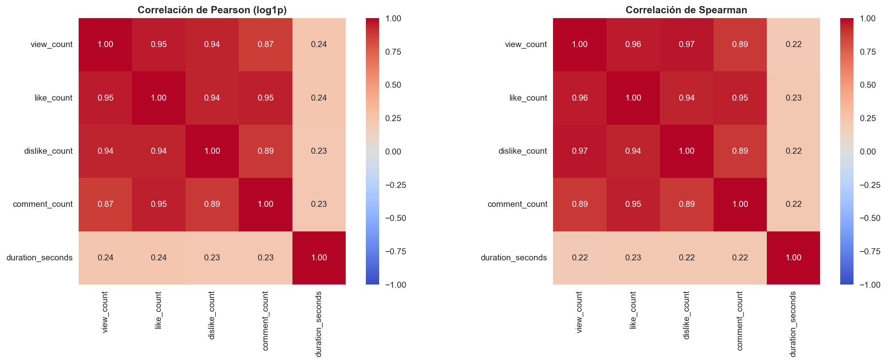

**Tabla 14: Resultados de la prueba de Kruskal-Wallis (variable numérica vs. clase)**

| Variable | Estadístico H | p-value | ¿Diferencia significativa entre clases? |
|----------|---------------:|--------:|:----------------------------------------|
| view_count | 523.87 | 3.20e-113 | Sí (p < 0.05) |
| like_count | 232.61 | 3.76e-50 | Sí (p < 0.05) |
| dislike_count | 399.39 | 3.00e-86 | Sí (p < 0.05) |
| comment_count | 150.65 | 1.91e-32 | Sí (p < 0.05) |
| duration_seconds | 129.94 | 5.57e-28 | Sí (p < 0.05) |

**Observaciones:**
- Las métricas de engagement presentan una correlación excepcionalmente alta entre sí (especialmente en Spearman y escala logarítmica): `view_count` y `dislike_count` (Spearman = 0.966, Pearson log = 0.940), `view_count` y `like_count` (Spearman = 0.956, Pearson log = 0.955), y `like_count` y `comment_count` (Spearman = 0.948, Pearson log = 0.947). Esta colinealidad casi unitaria desaconseja emplear los cuatro conteos como variables directas simultáneas; en su lugar, se deben formular ratios normalizados (likes/views, comments/views) según lo planificado para el feature engineering.
- Por su parte, `duration_seconds` mantiene correlaciones bajas con todas las variables de engagement (Pearson log entre 0.228 y 0.241, Spearman entre 0.217 y 0.225), por lo que provee una señal complementaria e independiente.
- En la prueba no paramétrica de Kruskal-Wallis, **las 5 variables numéricas** resultaron estadísticamente significativas ($p < 0.05$, de hecho todas con $p < 10^{-27}$), indicando que sus distribuciones difieren entre las cuatro clases. No obstante, dado el tamaño muestral amplio (~4,800 observaciones), diferencias distributivas pequeñas pueden alcanzar significancia estadística con facilidad; por ello, este resultado funciona como un filtro preliminar positivo (ninguna variable se descarta a priori), debiendo confirmarse su verdadera capacidad predictiva en la Etapa 2 mediante métricas de importancia de features con los modelos entrenados.

---

## 5. Análisis de Datasets Adicionales (Muestras)

### 5.1 Elsagate Related Videos (Muestra de 1,000 videos)

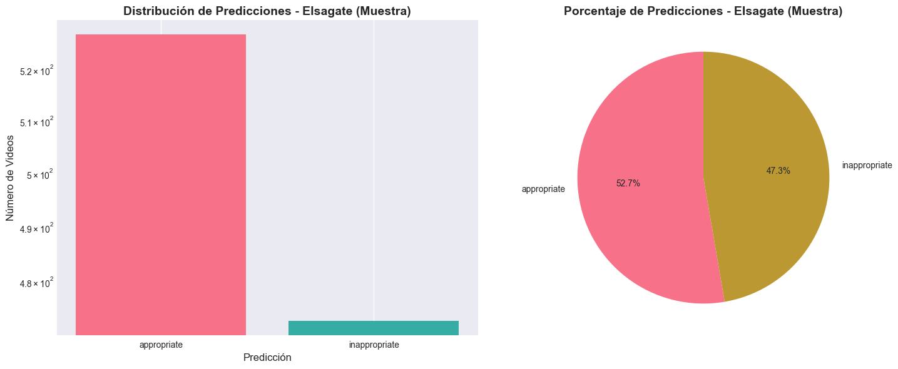

**Tabla 8: Distribución de Predicciones en Elsagate**

| Predicción | Cantidad | Porcentaje |
|------------|----------|------------|
| appropriate | 527 | 52.7% |
| inappropriate | 473 | 47.3% |

La muestra contiene 780 videos con ground truth (seeds) y 1,000 videos con predicciones (recomendados).

**Observaciones:**
- Casi la mitad de los videos relacionados con Elsagate son clasificados como inapropiados
- Esta muestra representa una fracción del dataset completo de ~233K videos
- La proporción de contenido inapropiado es consistente con las expectativas del fenómeno Elsagate

### 5.2 Other Child Related Videos (Muestra de 1,000 videos)

**Tabla 9: Distribución de Predicciones en Other Child**

| Predicción | Cantidad | Porcentaje |
|------------|----------|------------|
| appropriate | 985 | 98.5% |
| inappropriate | 15 | 1.5% |

La muestra contiene 70 videos con ground truth (seeds) y 1,000 videos con predicciones (recomendados).

**Observaciones:**
- La mayoría de los videos relacionados con niños son clasificados como apropiados
- Baja proporción de contenido inapropiado en este dataset
- Este dataset parece más seguro en comparación con Elsagate

### 5.3 Random Videos (Muestra de 1,000 videos)

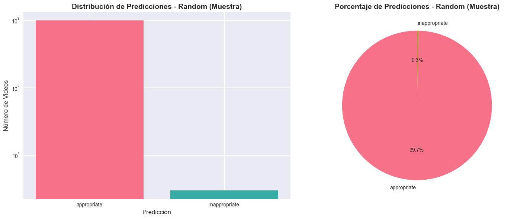

**Tabla 10: Distribución de Predicciones en Random**

| Predicción | Cantidad | Porcentaje |
|------------|----------|------------|
| appropriate | 997 | 99.7% |
| inappropriate | 3 | 0.3% |

La muestra contiene 34 videos con ground truth (seeds) y 1,000 videos con predicciones (recomendados).

**Observaciones:**
- La proporción de contenido inapropiado es muy baja en esta muestra aleatoria
- El resultado debe interpretarse con cautela porque se trata de una muestra de 1,000 videos
- Es importante evaluar la generalización del modelo con más datos etiquetados

### 5.4 Popular Videos (Muestra de 1,000 videos)

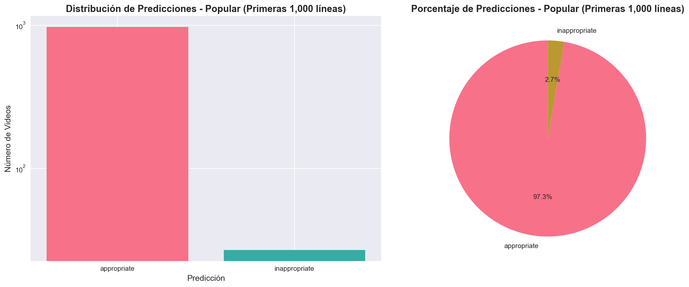

**Tabla 11: Distribución de Predicciones en Popular**

| Predicción | Cantidad | Porcentaje |
|------------|----------|------------|
| appropriate | 973 | 97.3% |
| inappropriate | 27 | 2.7% |

La muestra contiene 490 videos con ground truth (seeds) y 1,000 videos con predicciones (recomendados).

**Observaciones:**
- Los videos populares tienden a ser predominantemente apropiados
- Posible sesgo de YouTube en promocionar contenido seguro
- Baja proporción de contenido inapropiado en contenido mainstream

---

## 6. Análisis de Posible Fuga de Datos (Data Leakage)

Se revisaron cuatro fuentes potenciales de fuga de datos relevantes para el diseño experimental de la Etapa 2:

### 6.1 Columnas que codifican la etiqueta o la predicción original

El dataset incluye las columnas `prediction` e `is_ground_truth`, generadas por el clasificador automático de los autores del dataset y por el proceso de anotación, respectivamente. **Ninguna de las dos debe usarse como feature**: no son información disponible de forma independiente para un video nuevo, sino subproductos del propio proceso de etiquetado/clasificación original. Se verificó su presencia y valores en `dataset_groundtruth.csv` mediante el notebook: `prediction` contiene un 100% de valores nulos (4,797 registros NaN) e `is_ground_truth` toma el valor constante 1 para los 4,797 registros.

### 6.2 Duplicados dentro del ground truth

Se verificó la existencia de `video_id` duplicados dentro de `dataset_groundtruth.csv`. De existir duplicados, deben resolverse antes de hacer el split train/validation/test (quedarse con un único registro por video), ya que un mismo video repetido en train y en validation infla artificialmente el desempeño reportado.

Tras la ejecución del notebook, se constató que existen **0 videos duplicados** (mismo `video_id`) dentro del dataset de entrenamiento. Todos los 4,797 registros representan videos únicos.

### 6.3 Solapamiento entre ground truth y datasets adicionales

Se comparó el conjunto de `video_id` de `dataset_groundtruth.csv` contra los `video_id` presentes en las muestras de `elsagate_related`, `other_child_related`, `random_videos` y `popular_videos`. Esto es relevante porque el plan de trabajo (Sección de "Próximos pasos") usa el ground truth para entrenar y estos datasets adicionales para evaluar: si un mismo video aparece en ambos conjuntos, la evaluación sobre ese video dejaría de ser una prueba genuina de generalización.

**Tabla 15: Videos en común entre ground truth y cada dataset adicional (sobre la muestra de 1,000)**

| Dataset adicional | Videos en común con ground truth |
|--------------------|-----------------------------------:|
| elsagate_related | 780 (78.0%) |
| other_child_related | 70 (7.0%) |
| random_videos | 34 (3.4%) |
| popular_videos | 490 (49.0%) |

### 6.4 Concentración de videos por canal

Se analizó cuántos videos del ground truth provienen del mismo `channel_id`, y si los canales con más videos tienden a concentrarse en una sola clase. Si esto ocurre, existe riesgo de que un modelo "memorice" características propias del canal (estilo de miniatura, patrones de título recurrentes del mismo uploader) en lugar de aprender patrones generalizables de contenido inapropiado — y ese riesgo se convierte en fuga de datos real si videos del mismo canal quedan repartidos entre train y validation/test.

Al ejecutar el análisis, se identificaron 3,818 canales únicos, de los cuales **418 canales tienen más de un video** en el ground truth (con un máximo de 33 videos para un canal). Al inspeccionar la distribución de clases en el top 10 de canales con más videos, **9 de los 10 canales concentran el 100% de sus videos en una única categoría** (todos en `suitable`), y solo 1 canal (`UC9-oOzriEPfpPvjTOAu3Cww`, 33 videos) presenta mezcla de clases (20 `disturbing` y 13 `suitable`). Esto demuestra una fuerte concentración por canal y ratifica el riesgo de sobreajuste/fuga si no se controla adecuadamente.

### 6.5 Recomendaciones derivadas

- Excluir `prediction` e `is_ground_truth` de las features de entrenamiento.
- Eliminar duplicados de `video_id` en el ground truth antes del split, si los hubiera.
- Excluir de la evaluación en datasets adicionales cualquier video cuyo `video_id` ya esté en el ground truth de entrenamiento.
- Si hay concentración fuerte de clase por canal, usar un split agrupado por canal (por ejemplo `GroupShuffleSplit`) además de la estratificación por clase planteada en el plan de preprocesamiento, para que videos de un mismo canal no queden repartidos entre train y validation/test.

---

## 7. Conclusiones y Recomendaciones

### 6.1 Hallazgos Principales

1. **Balance de Clases:** El dataset de entrenamiento presenta un desbalance de clases significativo, con "irrelevant" siendo la clase mayoritaria (1,936 videos; 40.4%). Esto deberá abordarse mediante técnicas de balanceo durante el entrenamiento.

2. **Engagement y Contenido Inapropiado:** "Suitable" presenta la mayor media de visualizaciones, mientras que "restricted" presenta la mayor mediana de visualizaciones y media de comentarios. Las distribuciones tienen outliers fuertes, por lo que no es correcto atribuir el mayor engagement general a "disturbing".

3. **Características Discriminantes:** 
   - La duración: "suitable" tiene la mayor media (872.00 segundos) y mediana (443.5 segundos)
   - Longitud de títulos: "suitable" tiene los títulos más largos en promedio (61.88 caracteres)
   - Tags específicos pueden ser indicadores fuertes de clasificación

4. **Distribución de Contenido Inapropiado:**
   - Elsagate: 47.3% inapropiado (mayor riesgo)
   - Popular: 2.7% inapropiado
   - Other Child: 1.5% inapropiado
   - Random: 0.3% inapropiado

### 6.4 Resumen numérico del dataset de entrenamiento

- **Videos:** 4,797; **vistas totales:** 29,448,185,127
- **Media de vistas:** 6,142,717; **media de likes:** 26,878; **media de comentarios:** 2,378
- **Duración:** media de 752.06 segundos (12.5 minutos) y mediana de 345.5 segundos (5.8 minutos)
- **Título:** media de 53.7 caracteres y 9.3 palabras
- **Diversidad:** 17 categorías de YouTube, 3,811 canales y 3,705 tags únicos
- **Definición:** 3,748 videos HD (78.1%) y 1,048 SD (21.8%); un registro no tiene definición

### 6.2 Recomendaciones para el Modelado

1. **Preprocesamiento:**
   - Implementar técnicas de balanceo de clases (SMOTE, class weights, etc.)
   - Normalizar variables numéricas con alta variabilidad
   - Considerar transformación logarítmica para métricas de engagement

2. **Feature Engineering:**
   - Crear features basados en análisis de texto de títulos y descripciones
   - Utilizar embeddings de tags para capturar similitudes semánticas
   - Incluir ratios de engagement (likes/views, comments/views)

3. **Validación:**
   - Utilizar estratificación por clase en el split train/validation/test
   - Considerar métricas específicas para clases minoritarias (F1-score, recall)
   - Implementar validación cruzada robusta

4. **Despliegue:**
   - Establecer umbrales de probabilidad según el riesgo tolerable
   - Considerar sistema de revisión humana para casos de baja confianza
   - Monitorear continuamente el performance en datos reales

### 6.3 Limitaciones del Análisis

1. **Muestra vs Población:** Los datasets adicionales se analizaron solo con muestras de 1,000 videos, lo que puede no representar completamente la distribución real.

2. **Temporalidad:** Los datos corresponden a un periodo específico (2018), por lo que pueden no reflejar patrones actuales de YouTube.

3. **Sesgo de Etiquetado:** Las etiquetas manuales pueden contener sesgos subjetivos de los anotadores humanos.

4. **Evolución de la Plataforma:** YouTube ha cambiado significativamente desde 2018, por lo que los patrones pueden haber evolucionado.

---

## 8. Próximos Pasos

1. **Feature Engineering Avanzado:** Implementar técnicas de NLP para análisis de títulos, descripciones y tags.

2. **Modelado Baseline:** Entrenar modelos simples (logistic regression, random forest) como baseline.

3. **Modelos Avanzados:** Implementar deep learning (CNN para thumbnails, transformers para texto).

4. **Validación en Datos Reales:** Probar el modelo con los datasets adicionales completos.

5. **Sistema de Monitoreo:** Implementar seguimiento continuo del performance y drift de datos.

---

## 9. Referencias

- Dataset original: "Disturbed YouTube for Kids: Characterizing and Detecting Inappropriate Videos Targeting Young Children"
- Documentación de YouTube Data API v3